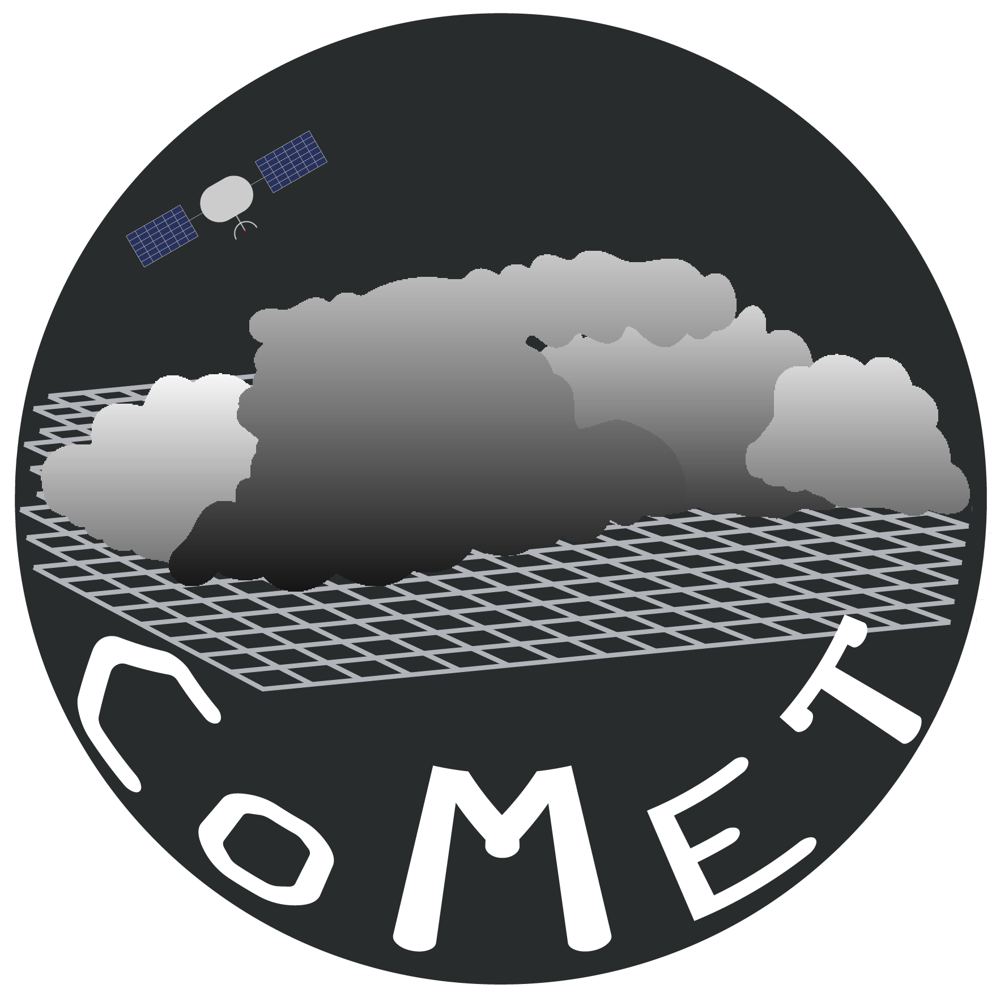
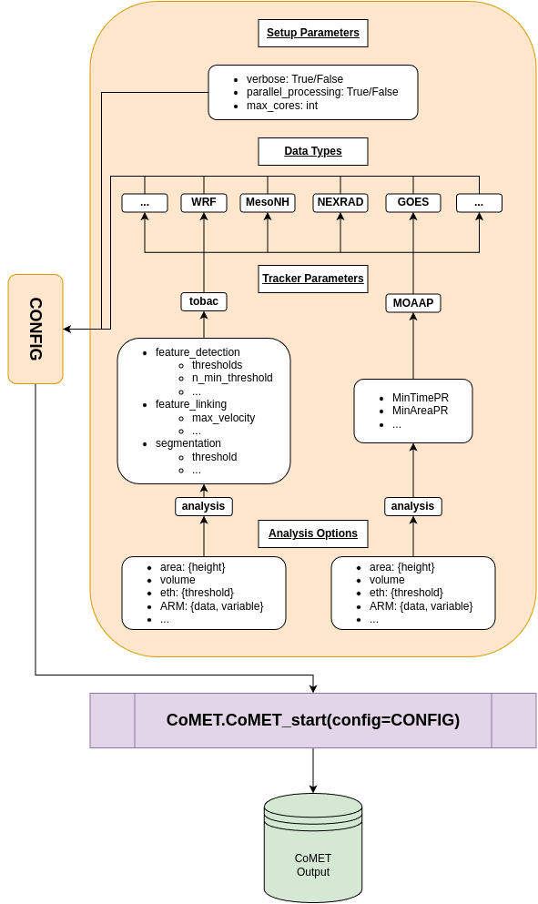
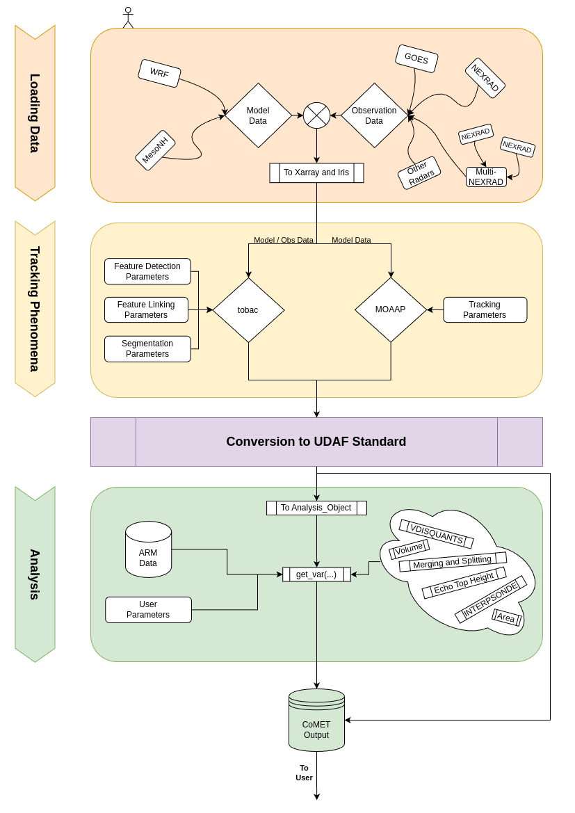

# CoMET

Convective cloud Model Evaluation Toolkit.

## User Workflow

## Internal Workflow

## Acknowledgments
This project was supported by the U.S. Department of Energy (DOE) Early Career Research Program, Atmospheric System Research (ASR) program, 
and the Office of Workforce Development for Teachers and Scientists (WDTS) under the Science Undergraduate Laboratory Internships Program (SULI).

If you are using this software for a publication, please cite: ####