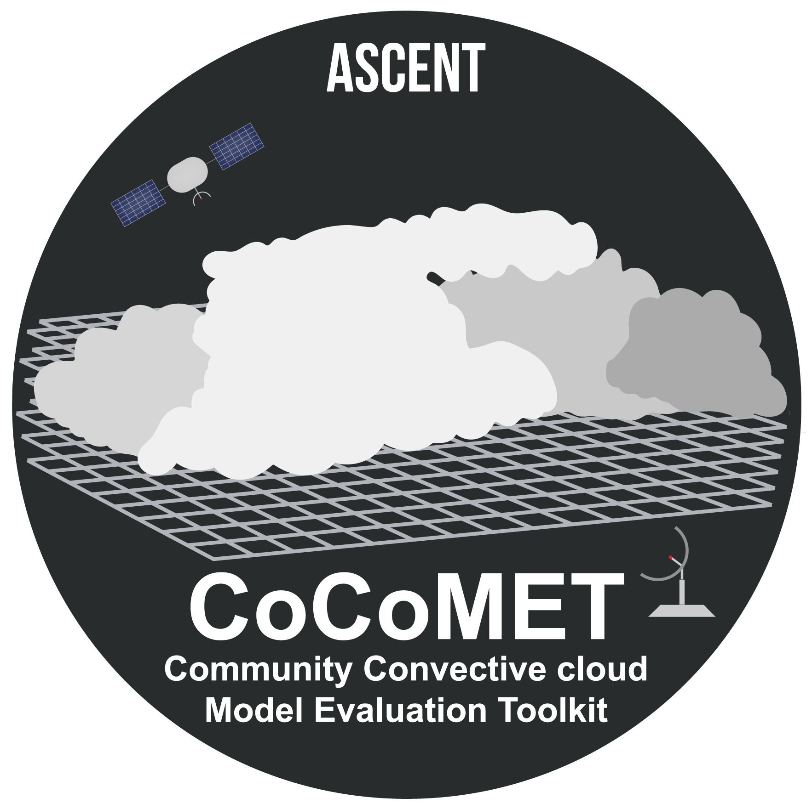
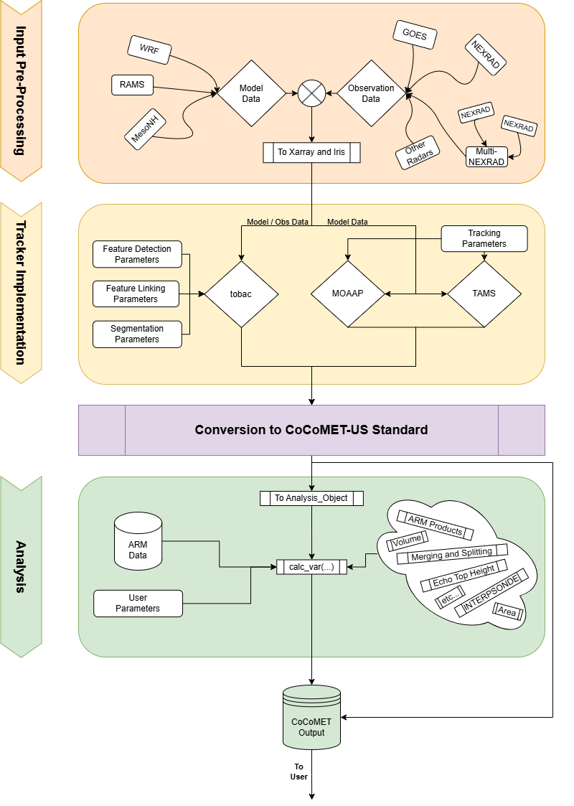

# CoCoMET


Community Cloud Model Evaluation Toolkit.

## CoCoMET Usage


### Installation
CoCoMET can be installed via _pip_
```
python -m pip install CoCoMET
```
Although, to ensure easy installation, we recommend installing CoCoMET within a _conda_ envrionment, installing the required version of _tobac_ (https://github.com/tobac-project/tobac/tree/main) and _cf-units_ (https://github.com/SciTools/cf-units) via _conda_ with
```
conda create -n cocomet_env python==3.12
conda activate cocomet_env
conda install -c conda-forge tobac==1.5.3 cf-units
```
before using _pip_ to install CoCoMET.


### CONFIG Files
A user guide can be found at: <a href="https://github.com/ASCENT-BNL/CoCoMET/blob/master/docs/user_guide/cocomet_user_guide.pdf">https://github.com/ASCENT-BNL/CoCoMET/blob/master/docs/user_guide/cocomet_user_guide.pdf</a> which contains further information on the configuration setup. Example notebooks are available in https://github.com/ASCENT-BNL/CoCoMET/tree/master/examples

A simple CONFIG.yml example is given here for tracking on level 2 archival Next Generation Weather Radar (NEXRAD) data.
```
# ===========================================Welcome To CoCoMET===========================================
# This is where most all functionality of CoCoMET can be specified. You can change any of the supplied 
# variables OR you can use a default suite of paramateres setup for different model and observation
# input types. 


# SETUP VARIABLES: These determine basic CoCoMET functionality
verbose: True #  [bool] Whether to use verbose output (loading bars, etc.). Required.
parallel_processing: False #  [bool] Whether or not to use parallel processing for certain tasks. Required.
max_cores: 4 #  [int] Number of cores to use if parallel_processing==True. Enter None for unlimited. Required if parallel_processing==True.

# Structered in this form:
# Observation Type:
#   path_to_data
#   additional_observation_parameters
#
#   tracker:
#       tracker_params
#
#       analysis:
#           analysis_variables

# We have the possible model and input types here
nexrad: # can be [wrf, mesonh, rams, nexrad, multi_nexrad, standard_radar, goes]
    path_to_data: "D:/Research/BNL/gitfinageling/latest_branch/CoCoMET/.cocomet_testing_datasets/NEXRAD/grids/*"  [str] Glob-like path to input data. Required.

    feature_tracking_var: "DBZ" #  [str] DBZ, TB, WA, or PR. Variable you want to track features on. Depends on input data source. Required.
    segmentation_var: "DBZ" #  [str] Variable you want to do the segmentation on. Same options as feature_tracking_var. Required.

    min_frame_index: 0 # [int] 0-based indexing, inclusive. If you want to select only a subset of the input data. A frame is a single input file. Optional.
    max_frame_index: 20 # [int] 0-based indexing, inclusive. Optional.

    gridding: # NEXRAD archival radar gridding using Py-ART. Parameter are found and explained here (https://arm-doe.github.io/pyart/API/generated/pyart.map.grid_from_radars.html)
        gridding_save_path: "./.cocomet_testing_datasets/NEXRAD/grids/" #  [str] Output path. Required.
        grid_shape: (40, 401, 401) #  [three tuple of floats] Grid shape determines spatial resolution. Required.
        grid_limits: ((500, 20000), (-200000., 200000.), (-200000., 200000.)) # [three tuple of two tuples of floats]. Required.

    # Possible trackers go here
    tobac: # can be [tobac, moaap, tams].
        # All parameters below are identical to those used by tobac, including naming conventions. https://tobac.readthedocs.io/en/stable/index.html
        feature_id:
            threshold: [20,30,40,50]
            target: "maximum"
            position_threshold: "weighted_diff"
            sigma_threshold: 0.5
            n_min_threshold: 4
        
        linking: 
            method_linking: "predict"
            adaptive_stop: 0.2
            adaptive_step: 0.95
            order: 1
            subnetwork_size: 10
            memory: 1
            v_max: 20
        
        segmentation_2d:
            height: 2 # km
            method: "watershed"
            threshold: 15
    
        analysis: # Section where all desired analysis outputs go. Exahustive list and required inputs can be found in the user guide. This section is optional and can be omitted if no fruther analysis is desired.
            merge_split-2d: { variable: "DBZ", height: 2, segmentation_type: "2d", cell_footprint_height: 2, steps_forward_back: 3}
        
```


**Current Features**:

1. **WRF**:  
   1. tobac tracking of variables  
      1. Reflectivity  
      1. Brightness temperature  
      1. Updraft velocity  
      1. Precipitation rate  
      1. Any WRF variables in the dataset (case sensitive)
   1. MOAAP tracking of MCSs and cloud shields
   1. TAMS tracking of MCSs and cloud shields  
1. **RAMS**:  
   1. tobac tracking of variables  
      1. Reflectivity  
      1. Brightness temperature  
      1. Updraft velocity  
      1. Precipitation rate  
      1. Any WRF variables in the dataset (case sensitive)
   1. MOAAP tracking of MCSs and cloud shields  
   1. TAMS tracking of MCSs and cloud shields  
1. **MesoNH**:  
   1. tobac tracking of variables:  
      1. Reflectivity  
      1. Brightness temperature  
      1. Updraft velcoity  
      1. Any MesoNH variables in the dataset (case sensitive)
   1. MOAAP tracking of MCSs and cloud shields
1. **NEXRAD**:  
   1. Automatically grid radars  
   1. tobac tracking of variables:  
      1. Reflectivity  
1. **Multi-NEXRAD**:  
   1. Automatically grid multiple radars  
   1. tobac tracking of variables:  
      1. Reflectivity  
1. **Standardized Radar Grids (Hahn et al. (2025) Supplemental Text 1):**  
   1. tobac tracking of variables:  
      1. Reflectivitiy  
1. **GOES**  
   1. tobac tracking of variables:  
      1. Brightness temperature  
1. **Analysis**:  
   1. Calculates areas at given height  
   1. Calculates volume
   1. Calculates perimeter and surface area
   1. Calculates convexity and sphericity
   1. Calculates velocity
   1. Calculates maximum intensity 
   1. Calculates echo top heights (and the analgous for other 3D variables)  
   1. Identifies mergers and splitters in 2D and 3D 
   1. Extracts ARM Products:  
      1. Links ARM VAP output to tracks  
      1. Links INTERPSONDE to tracks  
         1. Calculates convective initiation properties from INTERPSONDE data (CAPE, CIN, etc.)


**Planned Features**:
1. Post-processing functions
1. Add ARM Radars
1. Add RWP
1. Add IMERG Satellite Data
1. Calculate ECAPE
1. Visualization Features


## CoCoMET Workflow



## Acknowledgments
This project was supported by the U.S. Department of Energy (DOE) Early Career Research Program, Atmospheric System Research (ASR) program, and the Office of Workforce Development for Teachers and Scientists (WDTS) under the Science Undergraduate Laboratory Internships Program (SULI). This paper has been authored by employees of Brookhaven Science Associates, LLC, under Contract DE-SC0012704 with the U.S. Department of Energy (DOE). SG is supported by Argonne National Laboratory under U.S. DOE contract DE-AC02-06CH11357 and the ARM User Facility, funded by the Office of Biological and Environmental Research in the U.S DOE Office of Science. 

If you are using this software for a publication, please cite:

Hahn, T., Weiner, H., Brooks, C., Li, J. X., Gupta, S., and Wang, D.: CoCoMET v1.0: A Unified Open-Source Toolkit for Atmospheric Object Tracking and Analysis, EGUsphere [preprint], https://doi.org/10.5194/egusphere-2025-1328, 2025.
